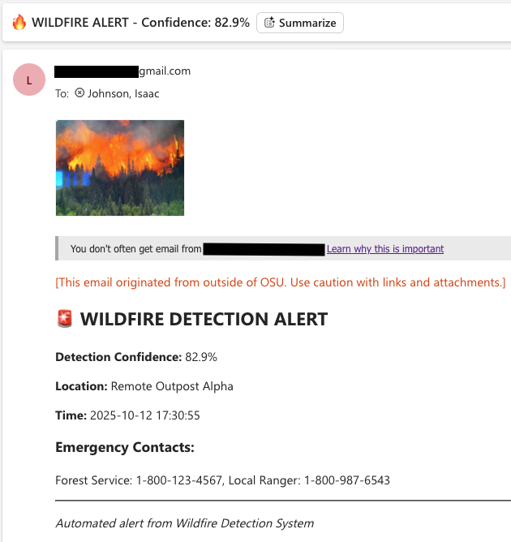

# Pi Wildfire Detector

This project is a wildfire detection system that runs on a Raspberry Pi, analyzes photos taken with the Pi Camera using a computer vision model, and sends the user an alert email if the a fire is detected in a photo.

## Hardware
Raspberry Pi 4 Model B  
Raspberry Pi Camera Module 2  
Heat Sink (optional)  
HDMI cable for Pi  
Pi power supply cord  
Raspberry Pi Camera Board Case (optional)  
Keyboard  
Mouse  
Monitor

Set up Pi with mouse, keyboard, HDMI to monitor, and camera module as shown in photo (camera should be adjusted with tripod or other support structure)


## Software Setup

Set up Raspberry Pi OS on Pi as per official instructions. Ensure Pi is connected to internet and git is installed

```git --version```

and clone the repository to the local drive in the Pi. Enter the cloned directory and run the setup script

```bash setup_pi.sh```

The script will prompt the user for a 'email_from' email address, from an a gmail account that the user controls and has set up to use app passwords. It will next prompt the user for 'email_password', the 16 letter app password for that email account. Finally, the script will prompt the user for 'email_to', the email address to send alerts to.

After successful setup, run the program with the following command

```python3 wildfire_detector.py``` 

The program will run and take a photo every 30 seconds, sending an alert email if the confidence level is above the threshold. If the program sends an alert email, it will trigger a cool down period of 5 minutes between email alerts to prevent the recipient email adress spam control from kicking in. The email alert includes the photo that triggered the alert, as seen in the example below:




## Model
The model was trained on the dataset found here https://www.kaggle.com/datasets/elmadafri/the-wildfire-dataset

El-Madafri I, Peña M, Olmedo-Torre N. The Wildfire Dataset: Enhancing Deep Learning-Based Forest Fire Detection with a Diverse Evolving Open-Source Dataset Focused on Data Representativeness and a Novel Multi-Task Learning Approach. Forests. 2023; 14(9):1697. https://doi.org/10.3390/f14091697

The training program is found on the Jupyter Notebook in the repo and trained on Kaggle using GPU T4 x 2 for 4 epochs. Model evaluation data shown in these two figures:


